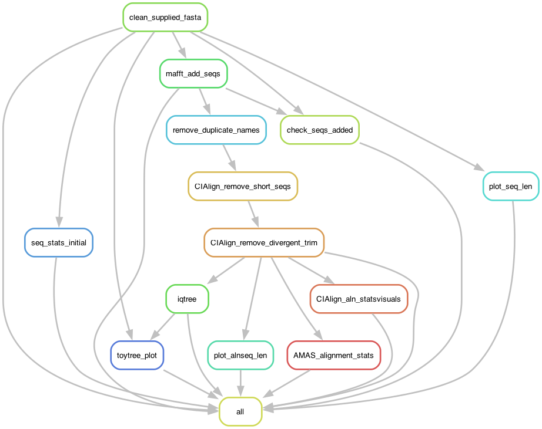

# NemaTree - Phylogenetic analysis of Root-Knot Nematode rRNA sequences

**This reproducible workflow processes rRNA sequences from Root-Knot Nematodes, including quality control, alignment, and reporting. The workflow makes use of an alignment of sequences from the diversity of Meloidogyne species.**

This will be useful for people with a small number (tens) of sequences who want to answer the question "where does this sample fall in the genus Meloidogyne?" and authors who want a good phylogenetic tree image for a publication.

Released under a permissive MIT license, you may pretty much do as you like. If you are able to cite this work it would be much appreciated:

> Lunt, DH (2026). NemaTree: Reproducible phylogenetic analysis of Root-Knot Nematode rRNA sequences. [https://github.com/davelunt/NemaTree](https://github.com/davelunt/NemaTree)

If you have issues, or would like additions, I may be able to help. If you improve this workflow, either contribute back to this repository or let me know, I may like to use that improvement myself.

## Quickstart - for people used to this sort of thing

1. git clone the repo and create conda environment from `envs/environment.yaml`
2. add sequences to `resources/samples/myseqsname.fas`
3. add `resources/samples/myseqsname.fas` to `config/config.yaml`
4. final tree: `results/reporting/toytree/myseqsname_mafft_cialign_iqtree.html`

## Workflow Overview

The user should provide DNA fasta sequences in a file in the `resources/samples/` directory. See [sequence help doc](docs/sequence_prep.md)

The workflow can be configured using the `config.yaml` file, where you can specify parameters such as the minimum sequence length and the reference alignment file.

The workflow will:

1. Perform quality control on the sequences
2. Align the sequences to the reference alignment
3. Build a maximum likelihood tree
4. Generate a tree image (html, png, svg) file

## Set up the workflow

1. download the workflow from GitHub
    - try: `git clone https://github.com/davelunt/NemaTree.git`
2. prepare the software environment using `mamba` or `conda` and the `environment.yaml` file
    - install `mamba` and `conda` if you don't have them already
    - try `mamba env create -f envs/environment.yaml`

Extra help is available in the [installation help doc](docs/installation.md)

## Running the workflow

### Provide a sequence file

Make sure you have provided (DNA not RNA) fasta sequences in a file in the `resources/samples/` directory. Using an informative short filename will help you keep track of your samples as it will be used throughout the workflow. No spaces in filenames. 

Tip: At a terminal in the workflow directory, run: `cat resources/samples/*.fas* > resources/samples/myseqsname.fas` to combine all fasta files into one file.

Extra [sequence_prep](docs/sequence_prep.md) help is provided. As a test, try setting the sequence file as `SSUtestadd.fas` or `LSUtestadd.fasta` and then running it as described below.

### Check `config/config.yaml`

This file should contain:

- a short name for your analysis (REQUIRED, this will be in all your output filenames)
- the path to your file containing your samples (REQUIRED)
- the name of the reference alignment file to which your sequences will be aligned. Choose between the whole genus or just clades123 (OPTIONAL)

Except for the sample file, all other config parameters have default values and can be left as is.

More help is provided in the [configure](docs/configure.md) docs for setting up the config file.

Help is provided in the [tree_formatting](docs/tree_formatting.md) doc for information on tree formatting and rooting.

### Dry run, then run the workflow

Begin with a dry run to check setup and that all files are present.

`snakemake -np`

If all is well, run the workflow with:

`snakemake --cores 4 --latency-wait 300`

You should now have an annotated phylogenetic tree that you can open in any web browser at `results/reporting/toytree/_mafft_cialign_cleaned_iqtree.html`

### Common problems

    - wrong capitalisation of the samples file name in config.yaml
    - spaces in filename, use_underscore_instead
    - failure to install the environment with conda/mamba
        - try `mamba env create -f envs/environment.yaml`
    - failure to activate the environment
        - try `conda activate nematree`
    - snakemake times out waiting for IQ-tree after 30s. Use `--latency-wait 300`
    - losing the final tree
        - try `results/reporting/toytree/myseqsname_mafft_cialign_cleaned_iqtree.html`

## Help

The documentation in `docs/` contains some more extensive help and advice:

- [installation](docs/installation.md): Information on installing the workflow and dependencies
- [configure](docs/configure.md): Information on the config.yaml file
- [sequence_prep](docs/sequence_prep.md): Information on preparing sequences to add
- [alignments](docs/alignments.md): Information on how sequence alignments are processed
- [tree_formatting](docs/tree_formatting.md): Information on tree formatting and rooting
- [misc](docs/misc.md): Extra thoughts and info

## Why did you make this?

I've seen a lot of papers showing the distinctiveness of a new species, or regional samples, by comparison to only a very small number of other species isolates. I thought having publicly available well-curated reference alignments of Meloidogyne LSU and SSU would be very useful for this sort of research.

I'm a big believer in reproducibilty in data analysis as (a) its the right way to do science and (b) its the easiest way to do science. So I wrote a reproducible workflow to do RKN phylogenetic analysis. Using this workflow has saved me an enormous amount of time while automating best practice approaches.
